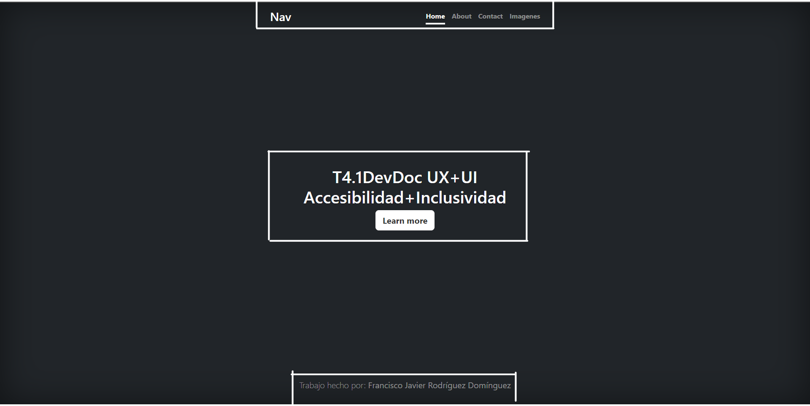
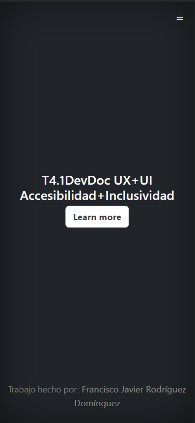
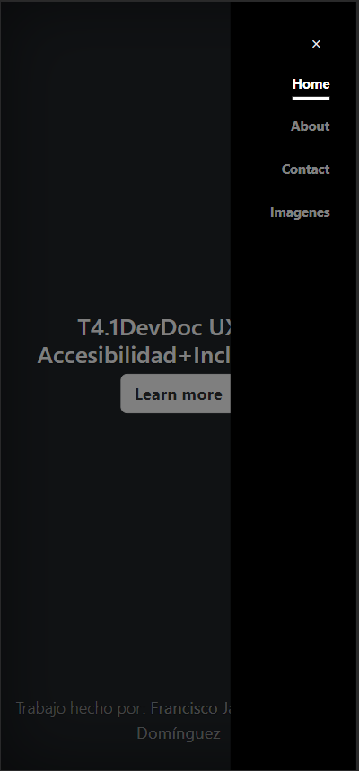

# T4.1DevDoc UX+UI+Accesibilidad+Inclusividad

## Leyes de UX utilizadas:

- **Ley de región común**  

En esta captura los elementos están separados de forma que aparecen 3 grupos. El de la parte superior como el menú de navegación, el del centro como el contenido principal y en la parte inferior como el final de página.  

- **Ley de contraste**  
  
En esta captura vemos como el botón de "Home" esta resaltado sobre los demás, para que sepamos nuestra ubicación en la página web.  

- **Ley de Fitts**  
      
En estas dos capturas se aprecia esta ley de manera que cuando pulsamos en el menú hamburguesa, situado en la parte superior derecha, las opciones del menú nos aparecen justo en el mismo sitio donde hicimos click, reduciendo el tiempo que tarda el usuario en interartuar con el.

## Links
- [Página](https://fjrodryguez.github.io/T4.1RodriguezFranciscoJavier/)
- [Figma](https://www.figma.com/file/3tRsIShyfDYCHd9kT2efrX/T4.1-RodriguezFranciscoJavier?type=design&node-id=0%3A1&mode=design&t=wPcLaNPYvASukRMO-1)
- [Github](https://github.com/FjRodryguez/T4.1RodriguezFranciscoJavier)

## Autor
- [FjRodryguez](https://github.com/FjRodryguez)
